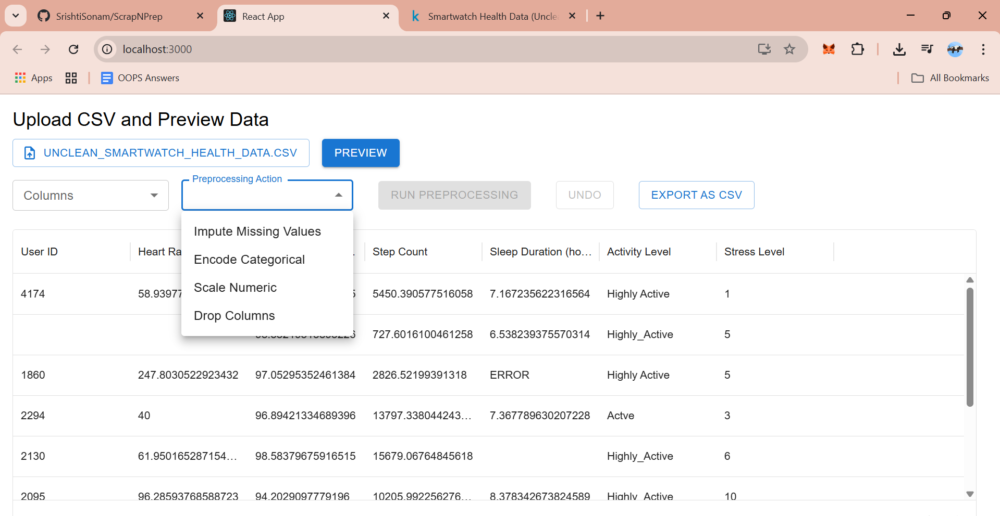
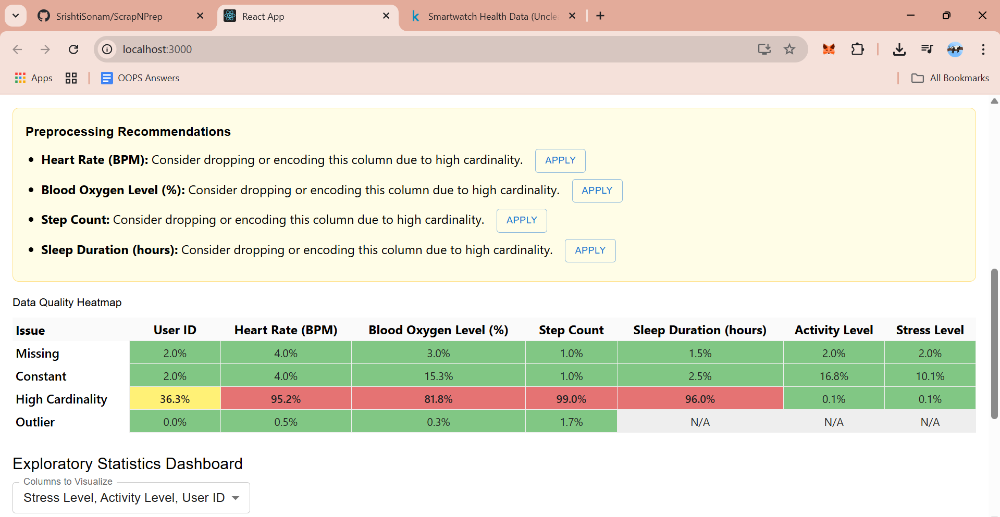
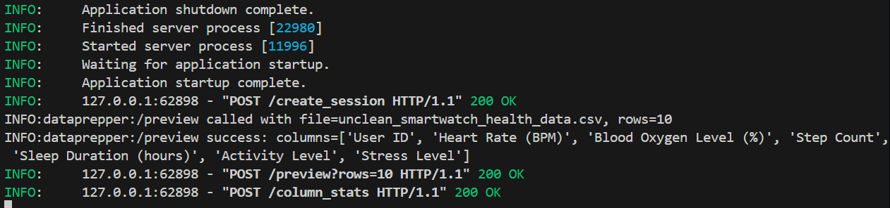

# ScrapNPrep

Here I am combing my two projects preparing and scraping into one package.

ScrapNPrep is an all-in-one data preparation and web scraping toolkit. It combines two powerful modules:

- **Preparing:** An interactive dashboard for preprocessing, cleaning, and exploring datasets, making them ready for machine learning workflows.
- **Scraping:** A modern web scraping solution to extract data from websites and save it in CSV or Excel formats.

**Outputs:**

### Data Preparation Dashboard

